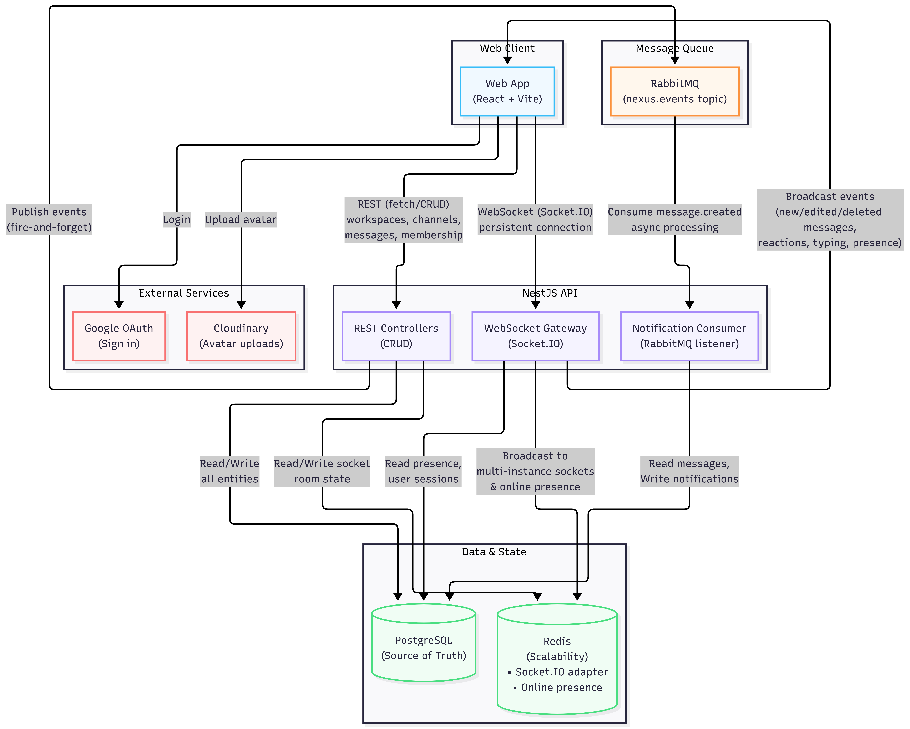
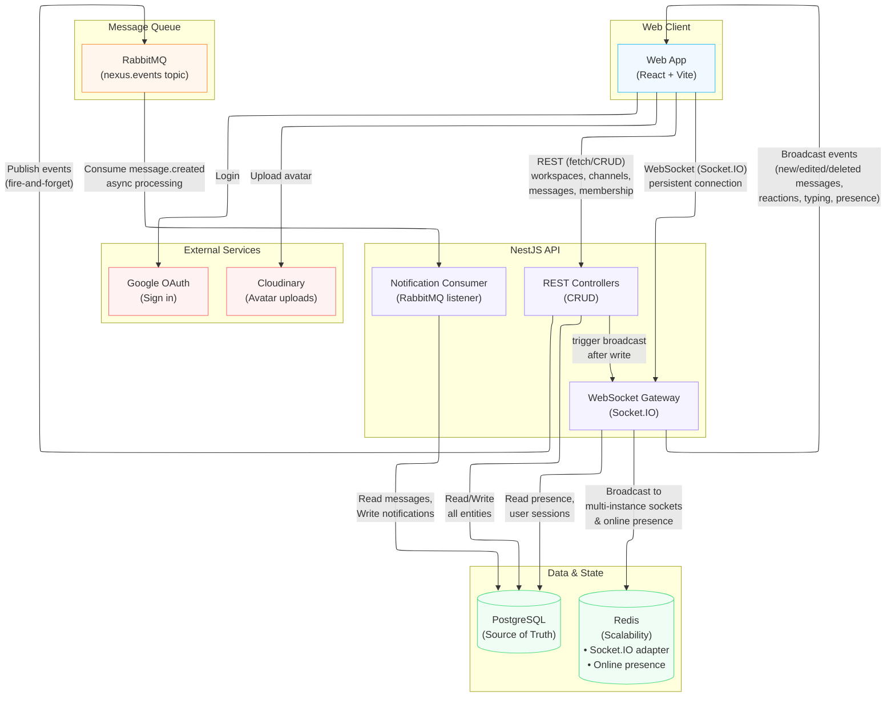
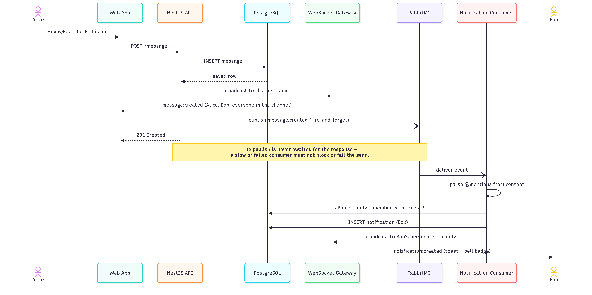
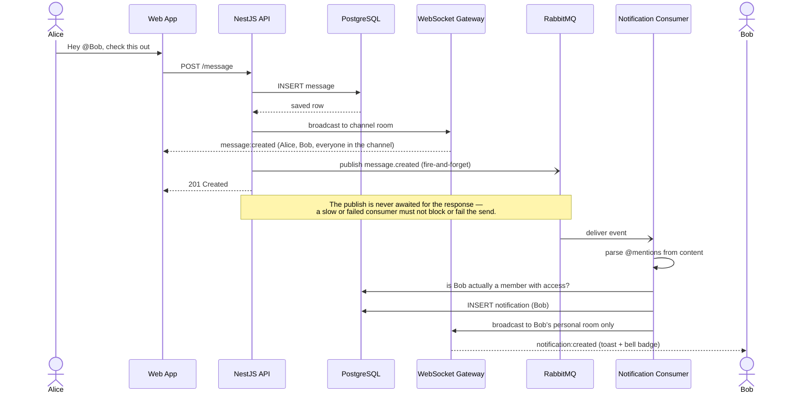
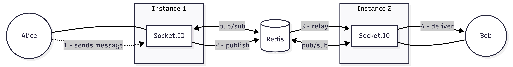
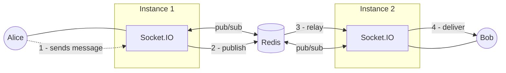

# Nexus

Nexus is a Slack-style real-time chat app. **The product is not really the point — it's the vehicle.** This project exists to actually *build*, not just read about, the pieces that make a chat app work at scale: real-time delivery, horizontal scaling, decoupled background processing, and the trade-offs each of those forces on you.

Every piece of infrastructure here was added because a specific, concrete problem showed up — not because a checklist said "production apps use Redis." That order matters and is explained below, because *why something was added* is the actual lesson, more than the fact that it exists.

---

## Why each piece of infrastructure is here

| Problem | Naive approach and why it breaks | What Nexus does |
|---|---|---|
| Messages must never be lost | Keep them in memory | **PostgreSQL** is the single source of truth for everything — messages, workspaces, channels, membership, reactions, notifications. Nothing important lives only in memory. |
| Users expect messages instantly | Poll the server every few seconds | A persistent **WebSocket** connection (Socket.IO) pushes changes the moment they happen — new messages, edits, deletes, reactions, typing, presence. |
| One Node process can't hold 10,000+ connections | Run one giant process and hope | The app is built so you can run **multiple API instances** behind a load balancer. The catch: two instances don't know about each other's WebSocket connections by default — a message accepted by instance A never reaches a socket connected to instance B. **Redis pub/sub** (`@socket.io/redis-adapter`) is what lets every instance broadcast to every socket, not just its own. |
| "Is this user online?" | Track it in a local in-memory `Map` | That answer is only correct for sockets connected to *that* process. Presence is instead tracked in **Redis sets** (`SADD`/`SCARD` per user), so the answer is correct no matter which instance a user's socket landed on. |
| Side effects shouldn't block or break the main action | Do everything inline in the request handler | Sending a message and fanning out mention notifications are different concerns with different reliability needs. **RabbitMQ** decouples them: the message send publishes an event and returns immediately; a separate consumer processes notifications asynchronously, can retry, and can never make a message fail to send. |
| Files (avatars) need to live somewhere durable | Store them on the API server's disk | Disk storage doesn't survive a redeploy and doesn't scale across instances. Avatars go to **Cloudinary** instead — the API never touches image bytes on disk. |

---

## Architecture



<details>
<summary>Mermaid source (renders natively on GitHub/GitLab; editable as text)</summary>



</details>

Day-to-day dev (`make dev`) runs one API process — but nothing in the design assumes that, and it's no longer just a claim: `make cluster` builds and runs 3 containerized API instances behind nginx, exercising the exact multi-instance path the Redis adapter exists for. See [docs/architecture.md](docs/architecture.md#process-topology) for the topology and [decisions/0006](docs/decisions/0006-nginx-sticky-sessions.md) for a non-obvious catch it required. Note the `RestCtrl → WSGateway` edge: a REST write (e.g. sending a message) doesn't just persist to Postgres — it also triggers the gateway to broadcast the change live, which is what the sequence diagram below shows step by step.

---

## How a single message actually travels through the system

This is the concrete version of the table above: what happens, in order, when Alice sends a message that `@mentions` Bob.



<details>
<summary>Mermaid source (renders natively on GitHub/GitLab; editable as text)</summary>



</details>

Two things worth noticing:

- **The message and the notification are two separate broadcasts on two separate paths.** Bob sees the message because he's in the channel's WebSocket room. He gets *notified about it* because a completely independent consumer, downstream of RabbitMQ, decided he should be. If the notification consumer were down entirely, messages would still send and broadcast fine — that's the point of decoupling it.
- **The API never waits on RabbitMQ to respond to the client.** Publishing is fire-and-forget from the request's perspective; only the database write is on the critical path.

---

## Why Redis specifically (not just "for caching")

Redis fills two distinct roles here, both about the gap between *"the code assumes one process"* and *"real chat apps run many."*



<details>
<summary>Mermaid source (renders natively on GitHub/GitLab; editable as text)</summary>



</details>

Without the adapter, step 3 doesn't happen — Bob's socket on instance 2 never hears about anything that occurred on instance 1. The same problem applies to presence: "online" status is tracked in Redis sets, not a local variable, so it's correct regardless of which instance answers the question.

---

## Tech stack

| Layer | Choice | Why |
|---|---|---|
| Frontend | React + Vite, TypeScript, Tailwind | Fast dev loop, no framework magic to fight while learning the backend concepts |
| Backend | NestJS (Node/TypeScript) | Structured DI + modules mirror how you'd reason about service boundaries in a larger system |
| Database | PostgreSQL + TypeORM | Relational integrity for a genuinely relational domain (users, workspaces, channels, membership, messages) |
| Auth | better-auth (email/password + Google OAuth) | Session-cookie based, works uniformly for REST and WebSocket auth |
| Real-time | Socket.IO | Rooms map cleanly onto "workspace," "channel," and "this one user" broadcast scopes |
| Horizontal scaling | Redis + `@socket.io/redis-adapter` | Turns multi-instance WebSocket broadcast from a hard problem into a config line |
| Async processing | RabbitMQ (topic exchange) | Decouples notification fan-out from the message-send request path |
| File storage | Cloudinary | Avatars need to live outside any single instance's disk |

---

## The build order (and why it matters)

This wasn't built infra-first. Each layer was added only once the previous one's limitation was actually felt:

1. **Auth** — nothing else is meaningful without knowing who's asking.
2. **REST + PostgreSQL** — get the core data model (workspaces, channels, messages, membership) right and persisted before anything gets real-time.
3. **WebSocket layer** — replace "refresh to see new messages" with live push, once REST proved the data model was solid.
4. **Redis** — added specifically to make the WebSocket layer horizontally scalable, not as a general-purpose cache reflex.
5. **RabbitMQ** — added once there was an actual side effect (mention notifications) worth decoupling from the request path.

If you're reading this to learn system design rather than to run the app: the sequence above is arguably the most useful part of this repo. Infrastructure justified in advance is a guess; infrastructure added to solve a problem you just hit is a lesson.

---

## Further reading

This README is the overview. Deeper, code-verified detail lives in [`docs/`](docs):

| Doc | Covers |
|---|---|
| [architecture.md](docs/architecture.md) | Module-level breakdown, the REST → WebSocket bridge, process topology |
| [database-design.md](docs/database-design.md) | Every table, column, and the no-ORM-relations design choice |
| [websocket-flow.md](docs/websocket-flow.md) | The full event catalog — every room, every client/server event |
| [scaling-plan.md](docs/scaling-plan.md) | What's already built for horizontal scale, and the known gaps if it actually ran at N instances |
| [decisions/](docs/decisions) | ADRs — the point-in-time "why" behind each infrastructure choice |

---

## Project structure

```
apps/
  api/                  NestJS backend
    src/
      auth/              better-auth instance + config
      workspace/         workspace CRUD + invite links
      channel/           channel CRUD + access control
      membership/        who belongs to what, with what role
      message/           messages + reactions
      notification/      mention notifications + RabbitMQ consumer
      chat/              the WebSocket gateway (rooms, presence, broadcasts)
      profile/           avatar upload (Cloudinary)
      common/
        redis/            Redis client + presence tracking
        rabbitmq/         RabbitMQ client + publish/consume helpers
        cloudinary/       Cloudinary client
        auth-users/       reads/writes better-auth's own user table
  web/                  React + Vite frontend
    src/
      components/        UI, organized by feature area
      lib/               API client, socket client, auth client
      pages/             the one routed page (/join/:inviteCode)

docker-compose.yml       Postgres, Redis, RabbitMQ
Makefile                 make dev / make up / make migrate / ...
```

---

## Running it locally

```bash
cp apps/api/.env.example apps/api/.env    # fill in secrets (see below)
cp apps/web/.env.example apps/web/.env

make install     # npm install in both apps
make migrate     # applies the better-auth schema
make dev         # Postgres + Redis + RabbitMQ, then the API and web app together
```

The app is then at `http://localhost:5173` (API on `:3000`). RabbitMQ's management UI is at `http://localhost:15672` (guest/guest) if you want to watch the `nexus.events` exchange and `notifications.mention` queue directly.

### Running the multi-instance cluster

To actually run the horizontally-scaled topology (3 API instances behind nginx) instead of a single API process:

```bash
make cluster          # builds and runs api1, api2, api3, nginx (needs apps/api/.env already filled in)
```

Point the frontend at nginx instead of a single instance — set `VITE_API_URL=http://localhost:8080` in `apps/web/.env` — then `make web`. `make cluster-logs` tails all four containers; `make cluster-down` stops them (leaves Postgres/Redis/RabbitMQ running). See [docs/architecture.md](docs/architecture.md#process-topology) for what this changes.

**Required for full functionality**, all as real accounts/credentials in `apps/api/.env`:
- `CLOUDINARY_*` — avatar uploads
- `GOOGLE_CLIENT_ID` / `GOOGLE_CLIENT_SECRET` — Google sign-in (needs a redirect URI of `http://localhost:3000/api/auth/callback/google` registered in Google Cloud Console)

Everything else (auth, workspaces, channels, messages, reactions, presence, notifications) works with just `make dev` and no external accounts.

Other useful targets: `make ps` (service status), `make logs` (tail Postgres/Redis/RabbitMQ), `make down` (stop everything), `make stop` (free dev ports 3000/5173).
