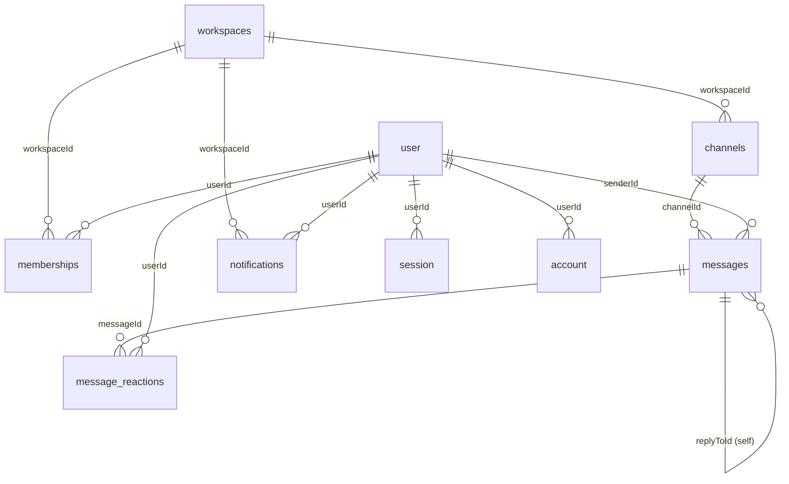

# Database Design

One physical PostgreSQL database, owned by two different migration mechanisms:

- **App entities** (workspaces, channels, messages, ...) — TypeORM, schema generated via `synchronize: true` outside production (no migrations folder for these tables).
- **Identity tables** (`user`, `session`, `account`, `verification`) — owned entirely by better-auth, applied via its own migration CLI (`apps/api/better-auth_migrations/`), never touched by TypeORM.

## Design choice: no ORM relations

Every cross-entity reference in this codebase (`workspaceId`, `channelId`, `senderId`, `userId`, `ownerId`, ...) is a plain string/UUID column — there are no `@ManyToOne`/`@OneToMany`/`@JoinColumn` decorators anywhere in `apps/api/src`. Joins happen explicitly in service code (`In(...)` queries batched into JS `Map`s), not through TypeORM's relation-loading.

The trade-off this creates: no automatic eager-loading surprises or N+1s hidden behind a `.relation` access, and every query's shape is visible in the service that makes it — at the cost of no DB-level referential integrity (nothing stops a row from pointing at a `workspaceId` that no longer exists) and no cascading deletes for free.

## Entities

### `workspaces`
| Column | Type | Notes |
|---|---|---|
| `id` | uuid | PK |
| `name` | string | |
| `slug` | string | unique |
| `icon` | string | default `💼` |
| `color` | string | default `from-cyan-500 to-blue-600` |
| `description` | string | nullable |
| `ownerId` | string | → `user.id` (logical, no FK constraint) |
| `inviteCode` | string | random, generated on create |
| `createdAt` | timestamptz | |

### `channels`
| Column | Type | Notes |
|---|---|---|
| `id` | uuid | PK |
| `workspaceId` | string | indexed, → `workspaces.id` |
| `name` | string | |
| `topic` | string | nullable |
| `isPrivate` | boolean | default `false` |
| `type` | `'text' \| 'voice' \| 'announcements'` | default `'text'` |
| `section` | `'general' \| 'channels' \| 'projects' \| 'direct-messages'` | default `'channels'` |
| `memberIds` | text[] | nullable — private-channel ACL, or for `section: 'direct-messages'` the exact two participant IDs |
| `createdAt` | timestamptz | |

There's no separate DM/conversation table — a direct message is just a `Channel` row with `section: 'direct-messages'` and `memberIds` holding the two participants.

### `memberships` (workspace ↔ user)
| Column | Type | Notes |
|---|---|---|
| `id` | uuid | PK |
| `workspaceId` | string | indexed, → `workspaces.id` |
| `userId` | string | indexed, → `user.id` |
| `role` | `'Owner' \| 'Admin' \| 'Member'` | default `'Member'` |
| `createdAt` | timestamptz | |

Unique on `(workspaceId, userId)` — one membership row per user per workspace.

### `messages`
| Column | Type | Notes |
|---|---|---|
| `id` | uuid | PK |
| `channelId` | string | indexed, → `channels.id` |
| `workspaceId` | string | indexed, denormalized to avoid a join for workspace-scoped queries |
| `senderId` | string | → `user.id` |
| `content` | text | |
| `isEdited` | boolean | default `false` |
| `replyToId` | uuid | nullable, self-referencing → `messages.id` |
| `createdAt` / `updatedAt` | timestamptz | |

### `message_reactions` (message ↔ user ↔ emoji)
| Column | Type | Notes |
|---|---|---|
| `id` | uuid | PK |
| `messageId` | string | indexed, → `messages.id` |
| `userId` | string | → `user.id` |
| `emoji` | string | |
| `createdAt` | timestamptz | |

Unique on `(messageId, userId, emoji)` — this is what makes toggling a reaction idempotent: the same user reacting with the same emoji twice removes it rather than duplicating a row.

### `notifications`
| Column | Type | Notes |
|---|---|---|
| `id` | uuid | PK |
| `userId` | string | indexed — the **recipient** |
| `type` | `'mention'` | only type implemented |
| `workspaceId` / `channelId` / `messageId` | string | logical FKs |
| `senderId` | string | who triggered it |
| `body` | text | |
| `read` | boolean | default `false` |
| `createdAt` | timestamptz | |

## Identity: better-auth's tables

These aren't TypeORM entities — `AuthUsersService` (`common/auth-users/`) queries them with raw parameterized SQL against the same Postgres database.

| Table | Key columns |
|---|---|
| `user` | `id`, `name`, `email` (unique), `emailVerified`, `image` (avatar URL), `username` (additional field, backfilled by a `databaseHooks.user.create.before` hook if not supplied), `createdAt`, `updatedAt` |
| `session` | `id`, `token` (unique), `userId` → `user.id` (cascade delete), `expiresAt`, `ipAddress`, `userAgent` |
| `account` | `id`, `userId` → `user.id` (cascade delete), `providerId`, `accountId`, `password` (email/password credential), OAuth tokens — unique on `(issuer, accountId)` |
| `verification` | `id`, `identifier`, `value`, `expiresAt` |

Every app entity's `senderId`/`userId`/`ownerId`/`memberIds` is resolved to a display-ready user object at *read* time via `AuthUsersService.findByIds`/`findById` — there's no DB-level FK from, say, `messages.senderId` to `user.id`; the relationship exists only by convention, enforced in application code.

## Junction tables at a glance

| Table | Links | Uniqueness |
|---|---|---|
| `memberships` | workspace ↔ user | `(workspaceId, userId)` |
| `message_reactions` | message ↔ user ↔ emoji | `(messageId, userId, emoji)` |
| `channels.memberIds` | channel ↔ user (array column, not a real join table) | — |

## Dead code, for the record

`apps/api/src/user/` and `apps/api/src/attachment/` exist as unmodified Nest CLI scaffolding — empty entity classes never registered with TypeORM, services returning placeholder strings. If you go looking for a `users` table or a file-attachment feature, it isn't there; identity is `user` (better-auth) and attachments aren't implemented (`HydratedMessage.attachments` is hardcoded to `[]`).

All relationships above except `user.session`/`user.account` (which are real Postgres FKs with `ON DELETE CASCADE`) are logical only — enforced in code, not by the database.
